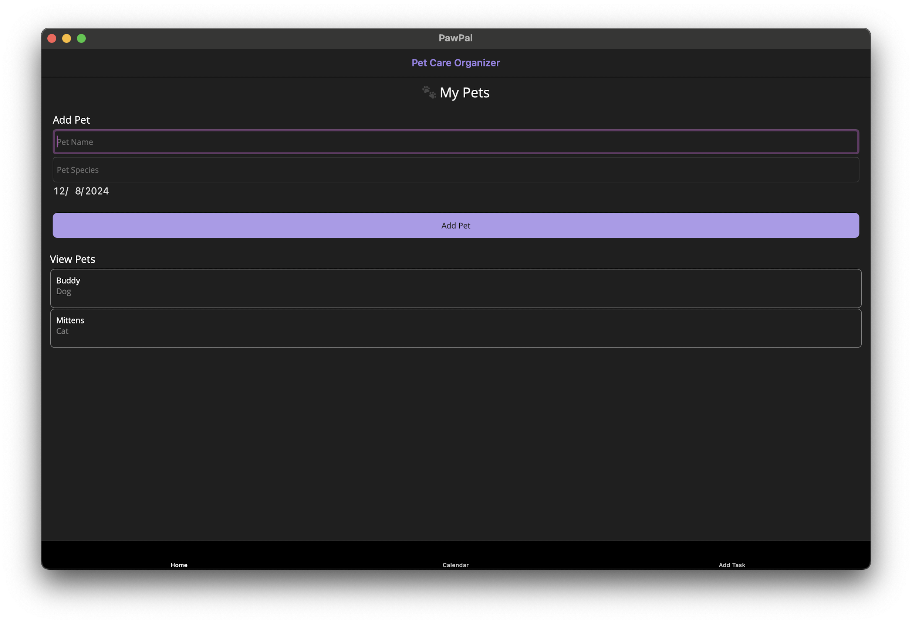
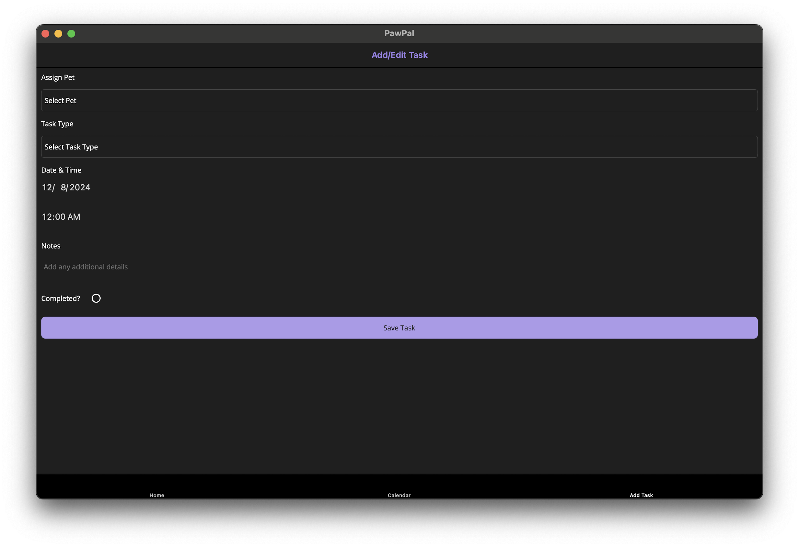

# 🐾 PawPal - Pet Care Organizer

PawPal is a .NET MAUI application designed to help pet owners manage their pets' information, track medical records, schedule tasks, and store vet contacts efficiently with SQLiteAsyncConnection for responsive database operations.

## 🚀 Features

✅ Pet Management – Add, edit, and delete pets with details like species and birthdate.\
✅ Vet Contacts – Save and manage veterinary contacts.\
✅ Task Scheduler – Keep track of upcoming pet care tasks.\
✅ Medical Records – Store important health records.\
✅ Local Notifications – Reminders for vet visits, vaccinations, and tasks.\
✅ User-Friendly UI - Modern and responsive design for easy navigation.

## 🛠️ Tech Stack

- .NET MAUI - Cross-platform framework
- MVVM Architecture - Separation of concerns for better maintainability
- XAML - UI design with data binding
- C# - Backend logic
- SQLite - Local storage for pet records

## Screenshots

Home Screen: Displays the list of pets and an overview of tasks.


Task Screen: Allows users to view and manage tasks assigned to each pet.


## Getting Started

To get started with PawPal, follow these instructions:

### Prerequisites

Ensure you have the following installed on your machine:

- [.NET 9 SDK](https://dotnet.microsoft.com/download/dotnet)
- Visual Studio 2022 or later with **.NET MAUI** workload

### Installation

1. Clone this repository to your local machine:

   ```bash
   git clone https://github.com/iNoles/PawPal.git
   ```

2. Open the project in Visual Studio.

3. Restore the dependencies:

   ```bash
   dotnet restore
   ```

4. Build and run the application:

   ```bash
   dotnet build
   dotnet run
   ```

5. The app should launch on your device or emulator, allowing you to add pets, assign tasks, and track them.

### Roadmap

- 🔹 Implement Recurring Tasks

## Contribution

If you'd like to contribute to PawPal, feel free to fork the repository, create a new branch, and submit a pull request with your changes.

### Steps for Contributing:
1. Fork the repository
2. Create a new branch (`git checkout -b feature/your-feature`)
3. Commit your changes (`git commit -am 'Add your feature'`)
4. Push to the branch (`git push origin feature/your-feature`)
5. Open a pull request
